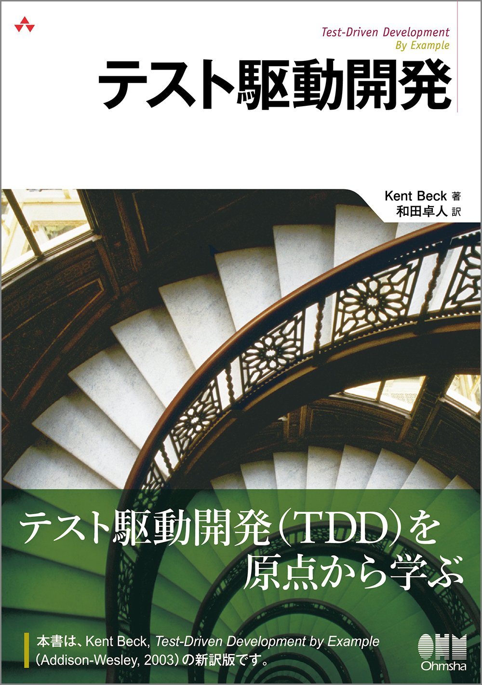

  

# Test-Driven Development - Kent Beck
I'm trying TDD with TypeScript in this repository. I'm sorry if there were mistakes in my codes.

## Technologies
- TypeScript
- Jest

## References
- [Test-Driven Development](https://www.amazon.co.jp/dp/B077D2L69C/)
- [Jestでテストを書こう](https://typescriptbook.jp/tutorials/jest)

